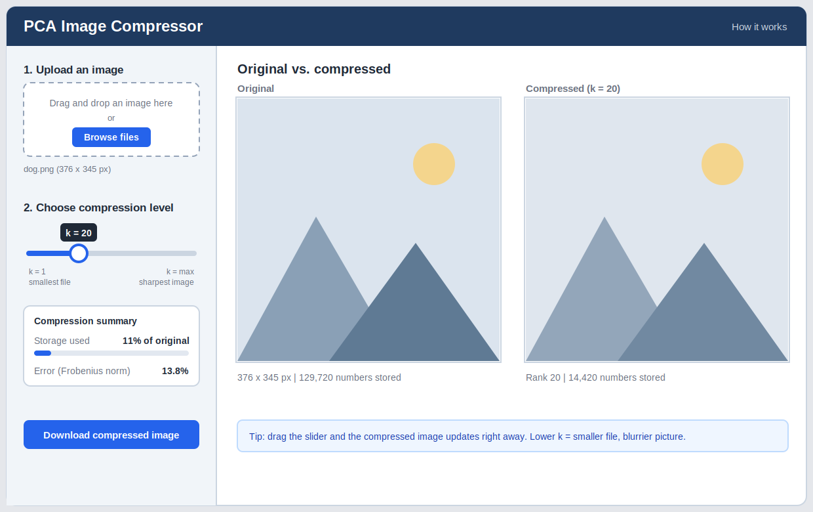

## Mockup

{width=100%}
*Mockup made with Claude with the description below. 

## How I would want it to look

I would use a single page with two areas: a narrow control sidebar on the left and a
large comparison area on the right. The sidebar reads top to bottom in the same order
someone would use the app (upload, choose, download), and the images get most of the space
because they are what the person came to look at.

## Other design choices

- Before an image is uploaded both panels show a gray placeholder that says
  "Upload an image to get started," and the slider is disabled.
- The compressed image updates when the slider moves, with a short tip
  under the images explaining that a lower k gives a smaller file and a blurrier picture.
